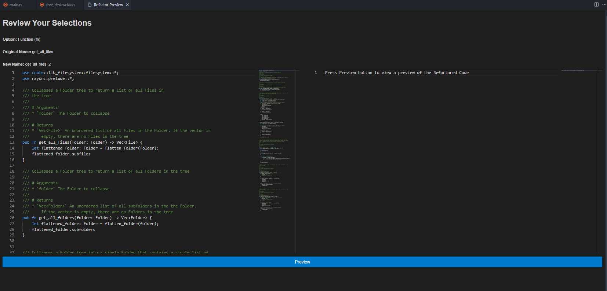
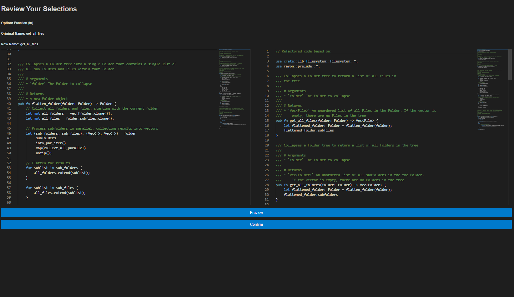

# REMVSCode

**REM VSCode** is a powerful extension that integrates the REM toolchain and
Rust Analyzer with Visual Studio Code to enhance Rust code refactoring
capabilities. This extension aims to provide comprehensive refactoring tools tailored
for Rust, streamlining the development process.

Currently it is in the Development Phase, as part of a Research Project being
conducted at the Australian National University by:
- Matthew Britton (matt.britton@anu.edu.au)
- Alex Potanin

https://marketplace.visualstudio.com/items?itemName=MatthewBritton.remvscode&ssr=false#overview

## Current Features

- **Easy Selection of Code**: Use familiar VSCode Shortcuts and menus to begin
  the refactoring process
- **Code Preview**: Preview the refactored code before changes are made to the
  codebase

*Pre Preview Screenshot*

*Post Preview Screenshot*

## Eventual Features

- **Refactor Rust Code**: Easily refactor Rust code with advanced tools from the REM toolchain and Rust Analyzer.
- **Context Menu Integration**: Access refactoring options directly from the editor's context menu.
- **Keyboard Shortcuts**: Trigger refactoring with a customizable keyboard
  shortcut (`Ctrl+Alt+F`).

## Refactoring Capabilities

- **NONE** (I'm working on it)

## Requirements

- **Visual Studio Code**: Version ^1.92.0 or higher.
- **Rust Analyzer**: Ensure Rust Analyzer is installed and configured in your VSCode setup.

## Extension Settings

This extension does not currently add any VS Code settings through the `contributes.configuration` extension point.

## Known Issues

- Currently, there are no known issues. Please report any bugs or feature requests on the [GitHub repository](https://github.com/RuleBrittonica/rem-vscode).

## Release Notes

### 0.1.0

- Initial release of REM VSCode.
- Test of the build process, has NO REFACTORING CAPABILITIES.

**Enjoy using REM VSCode!**